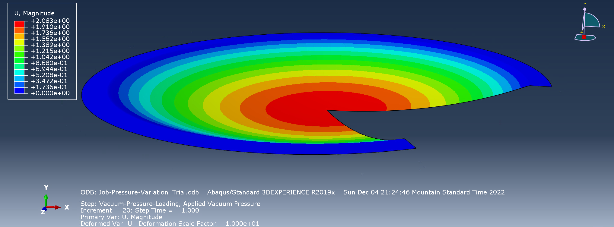
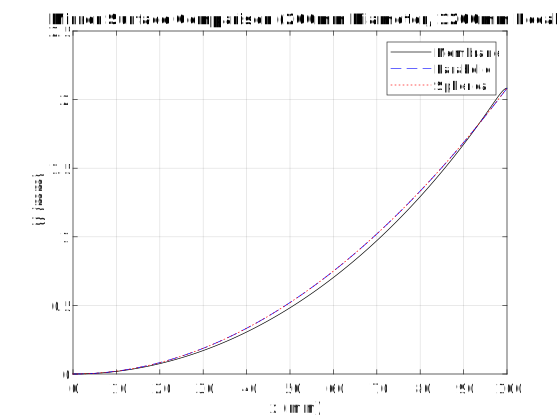

# Membrane Primary Mirrors for Telescopes
By: Stefen Gill

Primary mirrors in Newtonian telescopes are usually made from blanks of borosilicate glass that have been painstakingly ground to have a concave profile. The specific profile determines how well the primary mirror focuses parallel rays of light from a distant source to a single point, which determines image quality. For example, spherical profiles are relatively cheap to make but come with spherical aberration that produces blurry images. Parabolic mirrors are ideal because they have no aberration, but they are more difficult to make and thus more expensive. This project explores an experimental method for forming parabolic mirrors: pulling a vacuum on one side of a reflective membrane. The appeal is that this could be a cheaper, faster way to make primary mirrors without aberrations. This project aims to determine the vacuum pressure needed to deform a 200mm diameter aluminized PET membrane to have a focal length of 1200mm, and to investigate the mirror quality by how closely it compares to parabolic and spherical mirrors.

Abaqus FEA software is used to simulate the deformation of the aluminized PET membrane under various pressures. Several vacuum pressures are tested automatically using Python scripting within Abaqus. The Python script implements a Newton-Raphson root finding strategy to run several simulations to find the vacuum pressure that grants a central deflection corresponding to a 1200mm focal length. This pressure worked out to be 70.24Pa.

MATLAB scripting is then used to analyze the membrane mirror surface and compare it to parabolic and spherical mirrors designed to have the same 1200mm focal length. This analysis is covered in more detail in the report, `gill_membrane_mirror.pdf`. Ultimately, the membrane mirror is nowhere near an acceptable shape for use even in an amateur astronomer's telescope, exhibiting significantly more optical aberration than even a spherical mirror.

